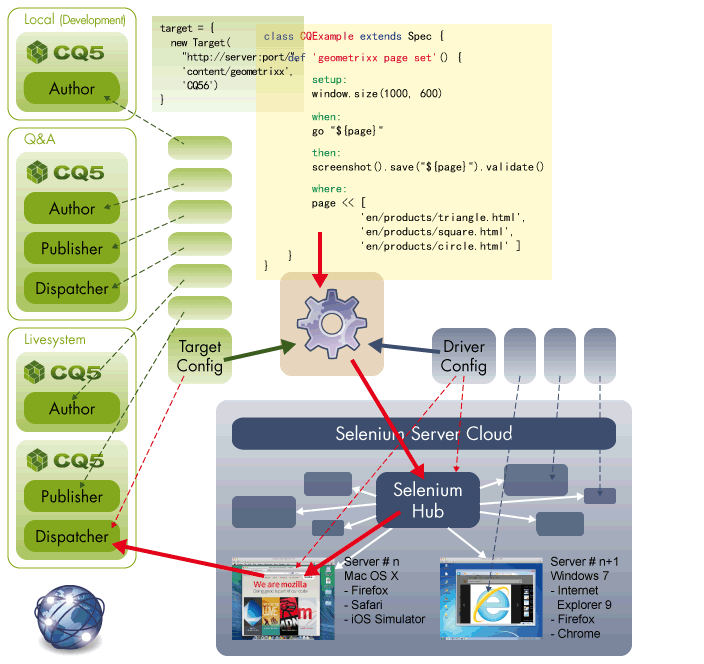

geb-spock-ext
=============

Some extensions for the 'Geb' / 'Spock' framework combination to make it more configurable, add an auto report feature and increase the capabilities to work with screenshots.

see also
  - http://www.gebish.org/
  - http://www.gebish.org/manual/current/index.html
  - https://github.com/geb/geb
  - https://code.google.com/p/spock/
  - https://code.google.com/p/spock/wiki/SpockBasics
  - https://github.com/spockframework/spock

